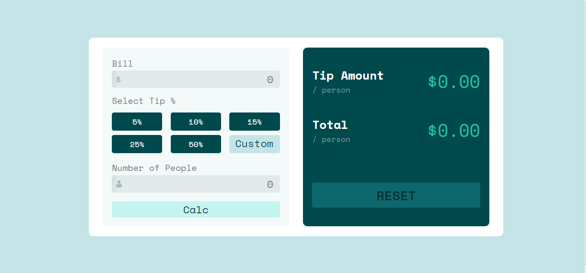

# Frontend Mentor - Tip calculator app

## 📝 Descrição

Um aplicativo web de Calcular Gorjeta. Esse projeto veio do desafio da [Front End Mentor](https://www.frontendmentor.io/) , então eu fiz ele usando meus proprios codigos, com apenas as fotos do desing pronto de referencia, por isso o Design não está identico ao proposto.

Se você quiser saber mais sobre o desafio entre na pasta readme´s e leia os readme que ali estão.

Link para acessar a Calculadora: https://calculadore-de-gorjeta.vercel.app/

## 🗃 Linguagens

- HTML
- CSS
- JS

## 🛠 Ferramentas e sites auxiliadores 

- VSCode
- Github Desktop
- Front End Mentor

## ⚙ Ajustes e Melhorias

- Trocar os input que recebem os numeros, para que aceite valores não inteiros.
- Melhorar a Responsividade
- Melhorar a Tradução do Site

## 👨🏾‍💻 Feito por 

<table>
  <tr>
    <td align="center">
    <a href="#">
         
        
          <b>Jean Pedro</b>
        
      </a>
    </td>
  </tr>
</table>